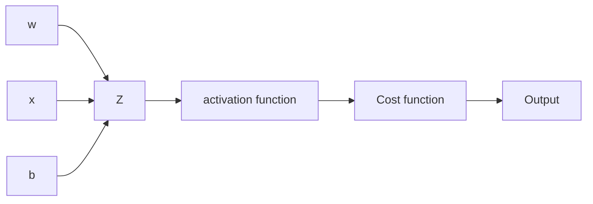

# Simple Neural Network

Simple neural network implementation example on C++. The main example creates a Neural Network and trains it on the MNIST data set to detect hand written digits.

## Build

To build this project with debugging output:
```
mkdir build
cmake -B build -DCMAKE_BUILD_TYPE=Debug
cmake --build build
./build/simple_nn
```
The build provides more logs. Otherwise can simply do:
```
cmake -B build -DCMAKE_BUILD_TYPE=Release
cmake --build build
./build/simple_nn
```

Note that the release build is **way** faster compared to the debug build when it comes to execution and training.

To run the tests after building (not a lot of tests right now):
```
cd build
ctest
```
## Usage

To use the SimpleNN two constructors are available, once to start from scratch defining the architecture of the network by providing a vector with the number of neurons in each layer, the following is a full example on how to create and train a network:
```
  // Input layer of 784 neurons
  // hidden layer of 30 neurons
  // 10 neurons in the output layer
  std::vector<int> arch{784, 30, 10};
  SimpleNN nn(arch);
  // Set function to validate data
  // Pass lambda
  nn.set_validation_function(
      [](Eigen::VectorXd output, Eigen::VectorXd label) -> bool {
        // Get the index of the maximum element in the result from the NN
        auto max_it_out = std::max_element(output.begin(), output.end());
        auto output_number = std::distance(output.begin(), max_it_out);

        // Get the index of the max element in the label, to find the label
        auto max_it_lab = std::max_element(label.begin(), label.end());
        auto label_number = std::distance(label.begin(), max_it_lab);

        return label_number == output_number;
      });
  // Set training parameters
  // 30 epochs, 3.0 learning rate, mini batch size of 10 and 10000 images for validation
  nn.set_config(30, 3.0, 10, 10000);
  nn.train(data.images, data.labels);
  nn.save_parameters("training_30_3-0_10_deep");
  auto result = nn.forward_propagation(data.images[0]);
```
- A network is created
- A lambda function is provided to the network to validate it's output against the labeled data, not required for training but it helps visualize the progress
- Hyperparameters are set
- Training starts
- Once training finished the weights and biases and saved in a binary file to be reused if required
- A forward pass is made and the result it's saved.

If the parameters of a trained network are already provided then one can create the network as follows:

```
  // Load parameters from file
  SimpleNN nn("training_1_3-0_10");
  auto result = nn.forward_propagation(data.images[0]);

```
The parameters can be loaded and the forward pass can be set right away with the pre-trained bias and weights.

main.cc contains the full example used by loading the MNIST data set for training and validation.

## Dependencies

This code uses Catch2 for testing as well as Cmake:

```
sudo apt install cmake
sudo apt install catch2
sudo apt-get install libeigen3-dev
```

To get the training, validation and testing data:

The MNIST dataset is in binary form and described [here](https://yann.lecun.org/exdb/mnist/) but basically for labels the file contains a:
- 32 bit magic number
- 32 bit number of labels
- unsigned bytes with the label from 0 to 9.

For images it is similar:
- 32 bit magic number
- 32 bit number of image
- 32 bit rows
- 32 bit columns
- unsigned byte pixels, row major.

Pixels are organized row-wise. Pixel values are 0 to 255. 0 means background (white), 255 means foreground (black).

Data was obtained [here](https://www.kaggle.com/datasets/hojjatk/mnist-dataset) and copied into `data` folder

And MNIST parser was created to read the data from binary into C++ std::vectors of Eigen::VectorXd.

## Notes

These are just some personal notes:
- Gradient descent requires calculating the gradient over all the training samples and then updating the parameters (weights and biases in this case), stocastic gradient descent does it over a single sample randomly selected from the training set and the middle ground commonly used and implemented here is mini-batches, where a small sample of randomly selected samples is used, the average gradient is calculated over them and then we update.
- After finishing all the mini-batches we have completed an 'epoch', so for instance in a training set of 100 samples with a mini-batch of 10, we would update the gradient 10 times (split the 100 samples into 10 mini-batches and update after calculating the gradient on each) and that would be an 'epoch'.
- We define a 'Cost function' with the objective of minimizing it and hence reduce the error, we define it as follows:

$C(w,b) = \dfrac{1}{2n}\sum_{x}\|\mathbf{y}(x)-\mathbf{a}\|^2$

- $w$ denotes all our weights
- $b$ all our biases
- $n$ is our training sample
- $x$ is our training input and the sumation is over all our training inputs
- $y$ is our expected target, or our label in this case
- $a$ is the output from the network

Now with a way to define our target function to minimize the goal is to calculate the [gradient](https://en.wikipedia.org/wiki/Gradient) which will give us a way to find the local minima by updating against it, e.g if the gradient is going 'up' we want to go down and viceversa.

$-\eta\nabla C$

Where:
- $\eta$ is the learning rate, a parameter that will help us decide how 'fast' we want to move through the gradient
- $\nabla C$ is the gradient of the cost function.

However what we really want is the gradient of the cost function with respect to our parameters $w$ and $b$ since we want to modify those and have it reduce our cost function.

$w \to w'= w -\eta\frac{\partial{C}}{\partial{w}}$

$b \to b'= b -\eta\frac{\partial{C}}{\partial{b}}$

And for stochastic gradient descent with mini-batches we want to update our parameters over the average of the gradient of the mini-batch training sample so:

$w \to w'= w -\frac{\eta}{m}\sum_{m}\frac{\partial{C}}{\partial{w}}$

$b \to b'= b -\frac{\eta}{m}\sum_{m}\frac{\partial{C}}{\partial{b}}$

It is easier to calculate $\frac{\partial{C}}{\partial{w}}$ and $\frac{\partial{C}}{\partial{b}}$ by looking at the computation graph since it is then just a matter of following the derivative backwards and 'chain' them togeter or multiply them together.


By following the diagram above one can calculate the following in reverse order:
- $\frac{\partial{C}}{\partial{a}}$ The derivative of the cost function with respect $a$ or the output of the activation function
- $\frac{\partial{a}}{\partial{z}}$ The derivative of the activation function $\sigma(z)$ wrt $z$
- Finally one can compute $\frac{\partial{z}}{\partial{w}}$ and $\frac{\partial{z}}{\partial{b}}$

And chaining them together gives:

$\frac{\partial{C}}{\partial{w}} = \frac{\partial{z}}{\partial{w}}\frac{\partial{a}}{\partial{z}}\frac{\partial{C}}{\partial{a}} $

$\frac{\partial{C}}{\partial{b}} = \frac{\partial{z}}{\partial{b}}\frac{\partial{a}}{\partial{z}}\frac{\partial{C}}{\partial{a}}$

And we know

$C(w,b) = \dfrac{1}{2}\|y(x)-a\|^2$

Where the derivative is:

$\frac{\partial{C}}{\partial{a}} = y(x)-a$

Then for $\frac{\partial{a}}{\partial{z}}$ we know in our case the activation function is the sigmoid

$a(z) = \sigma(z) = \frac{1}{1-e^{-z}}$

$\frac{\partial{a}}{\partial{z}} = \sigma'(z) = \sigma(z)(1-\sigma(z))$

Lastly

$z = wx + b$

Where $x$ is either the input or the output from the last layer activation.

$\frac{\partial{z}}{\partial{w}} = x$ and $\frac{\partial{z}}{\partial{b}} = 1$

Putting it altogether we now have a way to compute the gradient with respect to each weight and bias in the network:

$\frac{\partial{C}}{\partial{w}} = \frac{\partial{z}}{\partial{w}}\frac{\partial{a}}{\partial{z}}\frac{\partial{C}}{\partial{a}}= x\sigma'(z)(y(x)-a)$

$\frac{\partial{C}}{\partial{b}} = \frac{\partial{z}}{\partial{b}}\frac{\partial{a}}{\partial{z}}\frac{\partial{C}}{\partial{a}}=\sigma'(z)(y(x)-a)$

Note that $y(x)-a$ is only applicable to the last layer for previous layers we take in the previous $\delta$ and propagate it back instead.

## References

Useful resources used in understanding and creating this:
- [Michael Nielsen's book on neural networks](http://neuralnetworksanddeeplearning.com/index.html)
- [3Blue1Brown Series on Neural Networks](https://www.youtube.com/playlist?list=PLZHQObOWTQDNU6R1_67000Dx_ZCJB-3pi)
- [IBM article on SGD](https://www.ibm.com/think/topics/stochastic-gradient-descent)
- [CS231n Andrej Karpathy's lecture on backpropagation](youtube.com/watch?v=i94OvYb6noo&list=PLrR1Mq4E9nirxSBJKtN1u4337Je3-xt6s&index=1&pp=gAQBiAQB0gcJCRUKAYcqIYzv)
- [Andrej Karpathy on why you should understand backpropagation](https://karpathy.medium.com/yes-you-should-understand-backprop-e2f06eab496b)